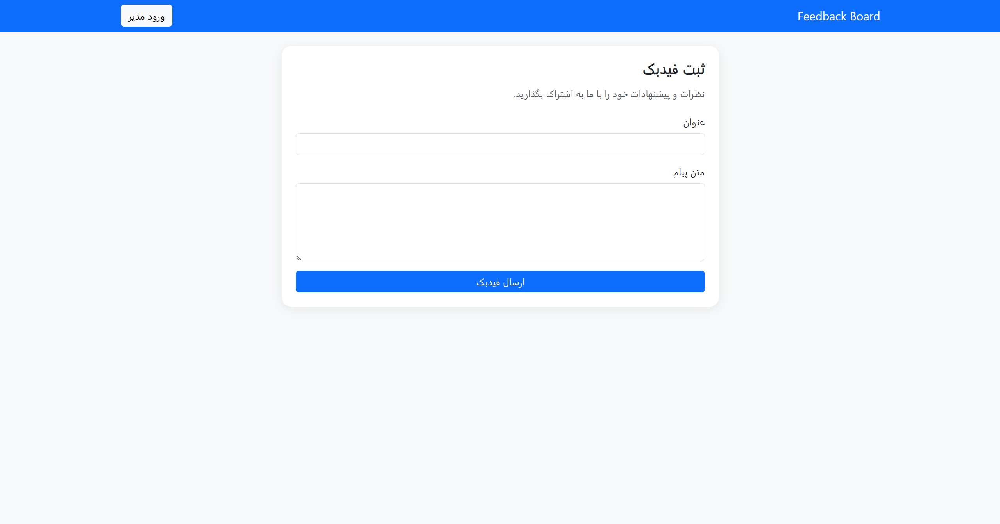
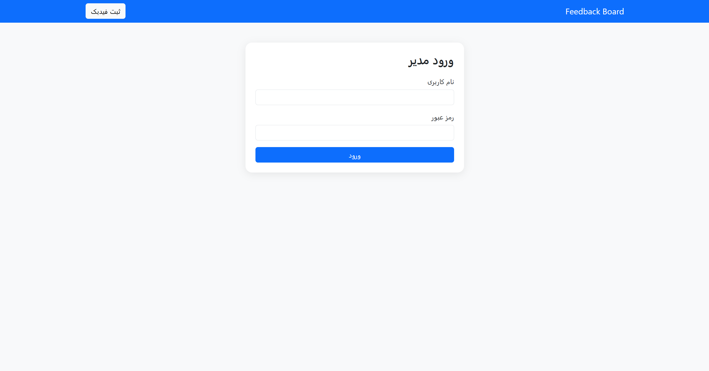
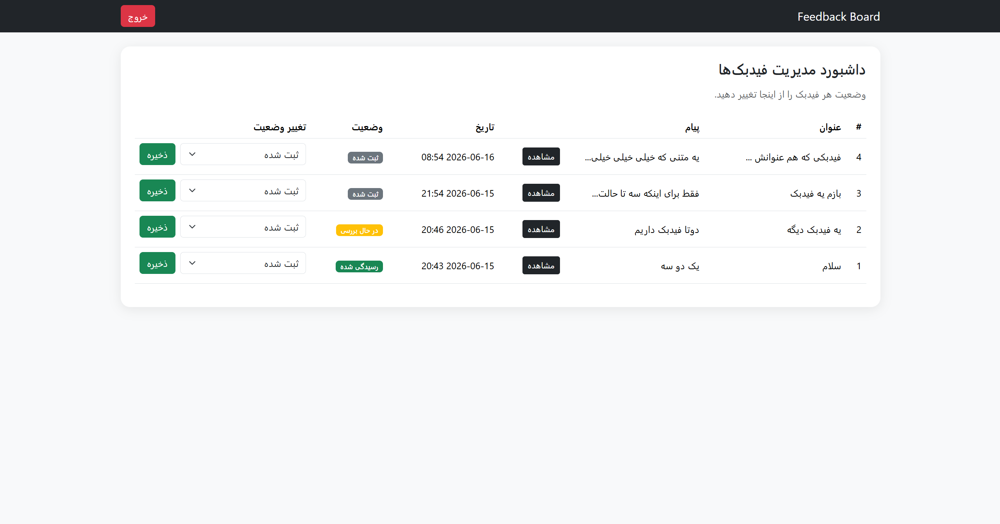

# 💬 Feedback Board

A simple feedback management system built with FastAPI, SQLite, SQLAlchemy, and Bootstrap.

---

## 📌 Overview

This project allows users to submit feedback and enables administrators to review and update the status of submitted feedback through a dashboard.

The application was developed as a small end-to-end product, focusing on simplicity, maintainability, and rapid delivery.

---

## 👩🏻‍💻 Developer

**Seyyedeh Fargol Nazemzadeh**

---

## ✨ Features

### 👤 User Side

* Submit feedback
* Provide a title and message
* Automatic feedback status assignment

### 🛡️ Admin Dashboard

* Secure Authentication for dashboard access
* View all submitted feedback
* Track feedback status
* Update feedback status

### 📬 Supported Statuses

* **Registered** (default status when feedback is created)
* **Under Review**
* **Resolved**

---

## 🔐 Authentication
To enhance security and prevent unauthorized status changes, a simple authentication system has been implemented:

* **Admin Login:** Users must enter a username and password to access the admin dashboard

* **Route Protection:** Unauthenticated users are automatically redirected to the login page when attempting to access the dashboard

* **Session Management:** Upon successful login, user information is stored in the session; clicking the logout button clears the session

* **Simple Validation:** Currently uses hardcoded credentials, with the flexibility to extend to a database-based authentication system in the future

---

## ⚙️ Technology Stack

### 🌐 Backend

* FastAPI
* SQLAlchemy
* SQLite

### 🎨 Frontend

* Jinja2 Templates
* Bootstrap 5

---

## 💡 Technical Decisions

### 1️⃣ Why FastAPI?

FastAPI provides a lightweight and modern framework that allows rapid backend development while keeping the codebase clean and maintainable.

### 2️⃣ Why SQLite?

SQLite is sufficient for the scope of this project and requires zero external configuration, making the setup process simple.

### 3️⃣ Why Server-Side Rendering?

Since the project requirements are relatively small, Jinja2 templates provide a simpler solution than introducing a separate frontend framework.

### 4️⃣ Why Session-Based Authentication?
Using sessions for authentication management is a simple and effective approach for small projects that don't require JWT or OAuth implementation. It integrates seamlessly with Jinja2 templates and provides a straightforward user experience.

---

## 🗂️ Project Structure

```text
feedback-board/
│
├── app/
│   ├── crude.py
│   ├── database.py
│   ├── main.py
│   ├── models.py
│   ├── routes.py
│   ├── schemas.py
│   │
│   ├── templates/
│   │   ├── dashboard.html
│   │   ├── feedback.html
│   │   └── login.html
│   │
│   └── static/
│       └── css/
│           └── style.css
│
├── screenshots/
│
├── .gitignore
├── requirements.txt
└── README.md
```

---

## 🛠️ Installation

### Clone Repository

```bash
git clone https://github.com/Fargolnz/Feedback-Board.git
cd Feedback-Board
```

### Create Virtual Environment

```bash
python -m venv venv
```

### Activate Environment

Windows:

```bash
venv\Scripts\activate
```

Linux / macOS:

```bash
source venv/bin/activate
```

### Install Dependencies

```bash
pip install -r requirements.txt
```

### Run Application

```bash
uvicorn app.main:app --reload
```

### Open

```text
http://127.0.0.1:8000
```

---

## 🔑 Admin Login Credentials
* **Username:** ```admin```

* **Password:** ```verystrongpass```

---

## 🖼️ Screenshots

### 💬 Feedback Submission



### 🔐 Login Panel



### 💻 Admin Dashboard



---

## 📝 Additional Notes

* The database is automatically created on the first run
* Status changes can only be performed by authenticated administrators
* All feedback entries are stored with their creation timestamp
* The application follows a simple, clean architecture that can be easily extended